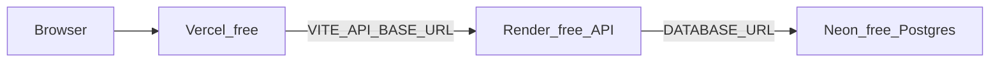

# AuraSense

Privacy-first focus, fatigue, posture, and attention monitoring built with React, Vite, Tailwind CSS, MediaPipe Face Mesh, and a Node API backed by **Neon Postgres** (free tier). Coaching uses **Groq in the browser**.

## $0/month stack



| Service | Cost | Role |
|---------|------|------|
| [Vercel](https://vercel.com) | $0 | Frontend (`npm run build`) |
| [Render](https://render.com) free web service | $0 | [`server/apiServer.js`](server/apiServer.js) |
| [Neon](https://neon.tech) free Postgres | $0 | Users + session history (months-long; not 30-day expiry) |
| Groq | $0 tier | AI coach via `VITE_GROQ_API_KEY` |

**Tradeoffs:** Render API sleeps after ~15 min idle (slow first request). Neon free may suspend when idle (wakes on connect).

## What is stored where

| Data | Storage |
|------|---------|
| Accounts (email unique, password hash, name) | **Neon** `users` table |
| Monitoring sessions (focus runs) | **Neon** `monitoring_sessions` table (per `user_id`) |
| JWT login token | Browser **`sessionStorage` only** |
| Theme / UI settings | Browser `localStorage` (preferences only) |

No `localStorage` user database. No JSON files on Render disk for production data.

## Setup

### 1. Neon database

Follow [docs/NEON_SETUP.md](docs/NEON_SETUP.md) to create a free project and copy `DATABASE_URL`.

### 2. Local development

```bash
npm install
cp .env.example .env
# Edit .env: DATABASE_URL, JWT_SECRET, VITE_API_BASE_URL, VITE_GROQ_API_KEY
npm run server   # :8787 — requires DATABASE_URL
npm run dev      # :5173
```

### 3. Render (API)

| Variable | Required |
|----------|----------|
| `DATABASE_URL` | **Yes** — from Neon |
| `JWT_SECRET` | **Yes** — long random string |
| `FRONTEND_ORIGIN` | **Yes** — Vercel URL, no trailing `/` |
| `REGISTRATION_ENABLED` | `true` |
| `PORT` | Set by Render |

**Remove** if still present: `GEMINI_API_KEY`, `GEMINI_MODEL` (unused).

Optional demo login: `DEMO_AUTH_ENABLED=true` + `DEMO_USER_*` (not stored in Postgres).

See [`render.yaml`](render.yaml) for the blueprint.

### 4. Vercel (frontend)

| Variable | Value |
|----------|--------|
| `VITE_API_BASE_URL` | Your Render API URL |
| `VITE_GROQ_API_KEY` | Groq API key |

## API routes

- `GET /api/health` — includes `databaseConnected`
- `POST /api/auth/register` · `POST /api/auth/login` · `GET /api/auth/me`
- `PUT /api/auth/profile` · `PUT /api/auth/password`
- `GET /api/sessions` · `PUT /api/sessions` · `PATCH/DELETE /api/sessions/:id`
- `GET /api/openapi.json`

## Tests

```bash
npm test
```

## Privacy

Facial analysis runs in the browser. Groq coaching sends summarized metrics only, not raw video.
